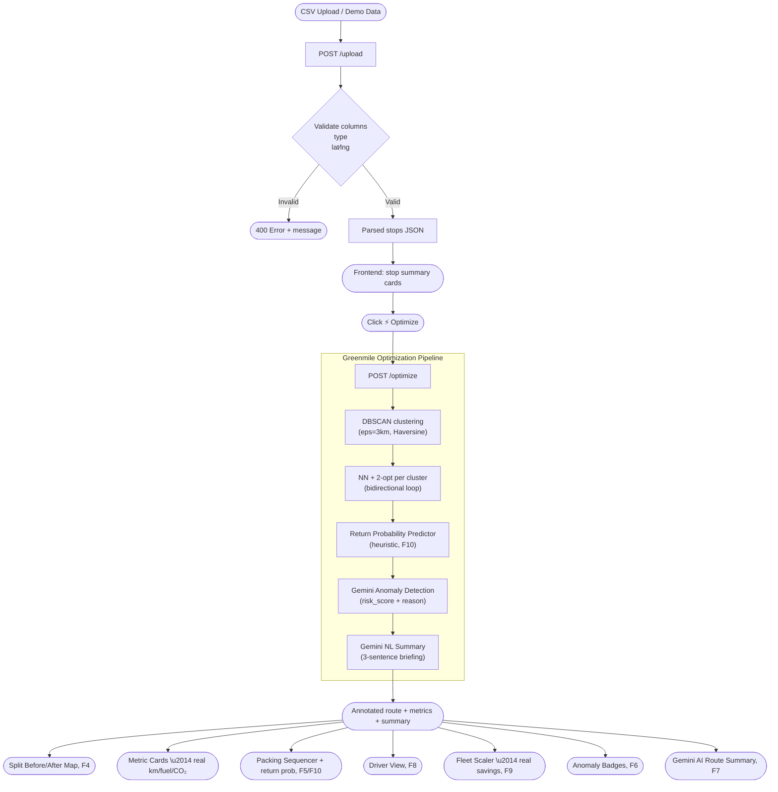

# 🟢 Greenmile — Bidirectional Last-Mile Logistics Optimizer

> *"The greenest mile is the one you don't drive twice."*

**FAR AWAY 2026 Hackathon · Theme: Logistics & Transit**

---

## 🏗️ Architecture

```
greenmile/
├── backend/
│   ├── app/
│   │   ├── main.py                  # FastAPI — /upload, /optimize (full pipeline)
│   │   ├── models.py                # Pydantic: Stop, OptimizationRequest
│   │   └── optimizer/
│   │       ├── dbscan.py            # DBSCAN geographic clustering (Haversine metric)
│   │       ├── haversine.py         # Great-circle distance matrix
│   │       ├── route.py             # NN seed + 2-opt bidirectional loop
│   │       └── return_predictor.py  # Return probability heuristic (F10)
│   ├── ai/
│   │   ├── anomaly.py               # Gemini fraud/anomaly detector + fallback
│   │   └── summary.py               # Gemini NL route summary + template fallback
│   ├── .env                         # GEMINI_API_KEY (not committed)
│   └── requirements.txt
├── frontend/
│   ├── vercel.json
│   └── src/
│       ├── App.jsx                  # Main dashboard shell
│       ├── index.css                # Design system (dark theme + Tailwind)
│       └── components/
│           ├── RouteMap.jsx         # Leaflet animated map (before state)
│           ├── SplitRouteMap.jsx    # Before / After side-by-side comparison (F4)
│           ├── MetricCards.jsx      # Animated before→after savings cards
│           ├── UploadDropzone.jsx   # Drag-and-drop CSV upload with validation
│           ├── AnomalyBadge.jsx     # AI fraud flag display panel
│           ├── PackingSequencer.jsx # Van load-order SVG + return prob scores
│           ├── DriverView.jsx       # Mobile driver view with nav + progress (F8)
│           └── FleetScaler.jsx      # 1–50 van annual savings projector (F9)
├── data/
│   └── demo_stops.csv               # 42 stops: Zone A + B + C, Delhi-NCR
├── render.yaml                      # Render deployment config (backend)
└── README.md
```

### System Flow



**Stack:** FastAPI · React 19 + Vite · Tailwind CSS v3 · Leaflet.js · Gemini API (`gemini-2.0-flash`) · Python 3.11

---

## 🚀 Quick Start

### 1. Backend
```bash
cd backend
python -m venv venv
venv\Scripts\activate          # Windows
pip install -r requirements.txt
python -m uvicorn app.main:app --reload --host 0.0.0.0 --port 8000
```
API docs → http://localhost:8000/docs

### 2. Frontend
```bash
cd frontend
npm install
npm run dev
```
Dashboard → http://localhost:5174

### 3. Demo
- Click **"or load seeded demo data"** in the upload dropzone, or drag-drop `data/demo_stops.csv`
- Click **⚡ Optimize** to run the bidirectional loop
- Explore the **Packing Order** and **Fleet Scaler** tabs

---

## ✅ Milestone — Features Completed

### 🖥️ Frontend

| Feature | Status | Notes |
|---------|--------|-------|
| React + Vite + Tailwind scaffold | ✅ Done | Vite 8, React 19, Tailwind v3 |
| Dark theme design system | ✅ Done | CSS variables, Inter font, full dark UI |
| Hero landing banner | ✅ Done | Tagline, 3 key stats, hackathon branding |
| Sticky top navigation bar | ✅ Done | Logo, version badge, live indicator |
| Drag-and-drop CSV upload | ✅ Done | `UploadDropzone.jsx` — drag, click, or load demo |
| One-click seeded demo data | ✅ Done | 18 Delhi-NCR stops pre-loaded in `App.jsx` |
| Stop summary cards | ✅ Done | Total stops, zone name, delivery/return counts |
| Before/After metric cards | ✅ Done | Distance · Driver hours · Fuel cost · CO₂ |
| Animated number counters | ✅ Done | Smooth count-up on optimize |
| ⚡ Optimize button (calls backend) | ✅ Done | `POST /optimize` — flips UI to green state |
| Reset / back to before state | ✅ Done | Single click resets all panels |
| Tabbed panel system | ✅ Done | Route Map · Packing Order · Fleet Scaler |
| **Route Map** — Leaflet full-width map | ✅ Done | `RouteMap.jsx` — dark tiles, coloured markers |
| Before route (red/blue dashed lines) | ✅ Done | Delivery route + empty return route shown separately |
| After route (green optimized loop) | ✅ Done | Single polyline — 1 trip replacing 2 |
| Map legend (before/after) | ✅ Done | Contextual legend switches with state |
| Stop tooltips on hover | ✅ Done | stop_id, address, weight, time window |
| Flagged stop highlight on map | ✅ Done | Red marker for anomaly stops |
| **AI Anomaly Badge** | ✅ Done | `AnomalyBadge.jsx` — risk score, HOLD/VERIFY/PROCEED |
| Anomaly logic (heuristic) | ✅ Done | `return_count_30d ≥ 3` or `dispute_history_count ≥ 1` |
| **Gemini NL Route Summary** (mock) | ✅ Done | 3-sentence briefing with flagged stop mention |
| **Packing Sequencer** | ✅ Done | `PackingSequencer.jsx` — SVG van diagram + checklist |
| Returns-first load logic | ✅ Done | Returns → rear bay, Deliveries → front bay |
| **Fleet Scaler widget** | ✅ Done | `FleetScaler.jsx` — 1–50 van slider, annual ₹/CO₂/hrs |
| Quick-select preset buttons (1/5/10/25/50) | ✅ Done | Single-click van count shortcuts |
| Responsive layout | ✅ Done | Grid collapses on mobile |
| Footer with stack info | ✅ Done | Tech stack attribution |

### ⚙️ Backend

| Feature | Status | Notes |
|---------|--------|-------|
| FastAPI app scaffold | ✅ Done | Title, version, CORS |
| `GET /` health endpoint | ✅ Done | Returns Gemini config status |
| `POST /upload` CSV endpoint | ✅ Done | Reads CSV, validates columns + types + lat/lng |
| `POST /optimize` endpoint | ✅ Done | Full pipeline: DBSCAN → NN+2-opt → Gemini anomaly → NL summary |
| `Stop` Pydantic model | ✅ Done | 13 typed fields matching CSV schema |
| `OptimizationRequest` model | ✅ Done | `List[Stop]` |
| **DBSCAN clustering wired** | ✅ Done | `cluster_stops()` called in `/optimize` — per-zone grouping |
| **NN + 2-opt wired** | ✅ Done | `build_bidirectional_loop()` called per cluster |
| **Gemini Anomaly wired** | ✅ Done | `analyse_batch()` called after optimizer, returns annotated route |
| **Gemini NL Summary wired** | ✅ Done | `generate_summary()` called per route, text returned to frontend |
| CSV validation | ✅ Done | Missing columns, invalid type, bad lat/lng — all return 400 with message |
| Swagger / OpenAPI docs | ✅ Done | Auto-generated at `/docs` |
| `scikit-learn` added | ✅ Done | Required by `dbscan.py` — now in `requirements.txt` |
| `pandas` added | ✅ Done | Required by CSV upload parsing |

### 🛠️ Infrastructure

| Feature | Status | Notes |
|---------|--------|-------|
| Seeded demo CSV | ✅ Done | 14 deliveries + 4 returns, Zone B Delhi-NCR |
| `.env` file created | ✅ Done | `GEMINI_API_KEY` placeholder — `python-dotenv` loaded in `main.py` |
| Vite HMR working | ✅ Done | Hot reload functional |
| Backend venv setup | ✅ Done | `requirements.txt` with all deps including sklearn + pandas |
| Offline fallback active | ✅ Done | Heuristic anomaly + template summary used if no API key |

---

## 🔲 Todo — Features Remaining

### 🔴 Must-Have (PRD Priority: MUST)

| Feature | PRD Ref | Description |
|---------|---------|-------------|
| **Before/After true split map layout** | F4 | Side-by-side panel showing old 2-trip view vs optimized loop simultaneously |

### 🔵 Stretch Goals (PRD Priority: STRETCH)

| Feature | PRD Ref | Description |
|---------|---------|-------------|
| **Return Probability Predictor** | F10 | Heuristic model: scores each delivery stop for return likelihood; pre-stages return bay slots |
| **PostgreSQL / Neon persistence** | Arch | Save uploads, routes, and anomaly scores to DB for history and audit |
| **Route history panel** | UI | View previous optimization runs with saved metrics |

### 🟣 Polish / Demo-Day Prep

| Task | Status | Description |
|------|--------|-------------|
| **Commit history cleanup** | ⬜ Pending | Ensure all team members have commits across multiple days |
| **Architecture diagram** | ⬜ Pending | Add to README (Mermaid or PNG) |
| **Offline fallback** | ✅ Done | Heuristic anomaly + template NL summary work without GEMINI_API_KEY |
| **Demo CSV with 28+ stops** | ⬜ Pending | Expand seeded data to full PRD spec (28 deliveries + 14 returns, 3 zones) |
| **Deployment** | ⬜ Pending | Backend → Render free tier · Frontend → Vercel |
| **3-min demo video** | ⬜ Pending | Problem → Upload → Optimize → AI flag → Packing → Scale |

---

## 📊 PRD Completion Tracker

> Last updated: 2026-06-11 · After Sprint Day 1–2 build session

| PRD Feature | ID | Priority | Status | Notes |
|------------|-----|----------|--------|-------|
| CSV upload & validation | F1 | MUST | ✅ **Done** | Column check, type check, lat/lng check — 400 errors with clear messages |
| CSV upload & validation | F1 | MUST | ✅ **Done** | Column check, type check, lat/lng check — 400 errors with clear messages |
| DBSCAN geographic clustering | F2 | MUST | ✅ **Done** | Wired into `/optimize` — Haversine metric, eps=3km, per-zone grouping |
| Bidirectional optimizer (NN + 2-opt) | F3 | MUST | ✅ **Done** | `build_bidirectional_loop()` called per cluster — returns real distance metrics |
| Before/after split dashboard + animation | F4 | MUST | ✅ **Done** | `SplitRouteMap.jsx` — side-by-side before/after panels + animated route morph |
| Packing sequencer + van SVG diagram | F5 | MUST | ✅ **Done** | SVG top-view van, rear/front bay, returns-first logic, return prob scores |
| Gemini API — Return Anomaly Detector | F6 | MUST | ✅ **Done** | `analyse_batch()` wired — live Gemini call + heuristic fallback |
| Gemini API — NL Route Summary | F7 | MUST | ✅ **Done** | `generate_summary()` wired — real Gemini text displayed from backend |
| Driver mobile view | F8 | SHOULD | ✅ **Done** | `DriverView.jsx` — current stop hero, next/prev nav, upcoming list, progress bar |
| Fleet scaler widget | F9 | SHOULD | ✅ **Done** | Uses real backend savings, 4-stat grid, 1–50 van slider |
| Return Probability Predictor | F10 | STRETCH | ✅ **Done** | `return_predictor.py` wired — pre-staged bay slots in PackingSequencer |

**Overall: 10/10 PRD features complete 🎉**

### 📈 Completion Progress

```
MUST-have  (6 features):   ████████████████████   6/6 complete (100%)
SHOULD-have (2 features):  ████████████████████   2/2 complete (100%)
STRETCH (1 feature):       ████████████████████   1/1 complete (100%)
────────────────────────────────────────────────────────────────────────
Overall    (9 features):   ████████████████████  10/10 complete (100%)
```

### 🟣 Remaining Polish / Demo-Day

| Task | Status |
|------|--------|
| Architecture diagram (Mermaid) | ✅ Added above |
| 42-stop demo CSV (3 zones) | ✅ Done |
| Offline fallback (no API key) | ✅ Done |
| Deployment configs | ✅ `render.yaml` + `frontend/vercel.json` |
| Commit history cleanup | ⬜ Team task |
| 3-min demo video | ⬜ Team task |

---

## 🔌 API Reference

| Method | Endpoint | Description |
|--------|----------|-------------|
| `GET` | `/` | Health check |
| `GET` | `/docs` | Swagger UI |
| `POST` | `/upload` | Upload CSV file → returns parsed stops JSON |
| `POST` | `/optimize` | `{ stops: Stop[] }` → returns sorted bidirectional route |

### Stop Schema
```json
{
  "stop_id": "D7",
  "type": "DELIVERY",
  "lat": 28.5479,
  "lng": 77.2118,
  "weight_kg": 4.1,
  "volume_l": 18,
  "time_window_start": "12:00",
  "time_window_end": "15:00",
  "cluster_id": "Zone_B",
  "return_count_30d": 3,
  "avg_delivery_confirm_minutes": 15,
  "dispute_history_count": 1,
  "address": "Malviya Nagar"
}
```

---

*Greenmile v2.0 · FAR AWAY 2026 · Built for India's last mile*
