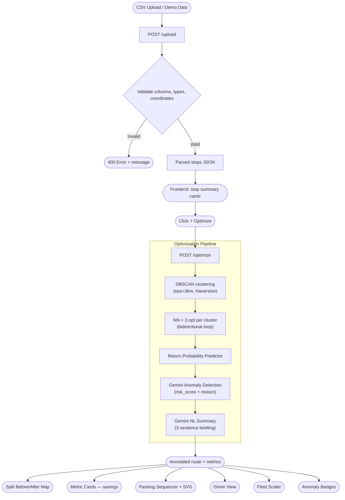

# 🟢 Greenmile — Bidirectional Last-Mile Logistics Optimizer

> *"The greenest mile is the one you don't drive twice."*

**Greenmile** is an AI-powered logistics optimizer that merges outbound deliveries and inbound returns into a single smart loop — eliminating the empty-van problem that wastes 40% of last-mile fuel in India.

Built for **FAR AWAY 2026 Hackathon · Theme: Logistics & Transit**

---

## 📌 The Problem

Every day, Indian delivery fleets run **two separate trips** for the same set of customers:

```
Trip 1 (Delivery):   Warehouse ──📦──→ Customers ──🚫──→ Warehouse   (van returns EMPTY)
Trip 2 (Returns):    Warehouse ──🚫──→ Customers ──📦──→ Warehouse   (van leaves EMPTY)
```

That's **2 trips, 2 fuel tanks, 2 driver shifts** — for work that one loop could cover. No existing tool on the market combines deliveries and returns into a single optimized route.

## 💡 The Solution

Greenmile merges both trips into **one bidirectional loop**:

```
Warehouse ──📦 deliver──→ Customers ──↩️ collect returns──→ Warehouse
                       ONE TRIP. ONE VAN. ONE DRIVER.
```

The van delivers packages on the way out and picks up returns on the way back. No empty legs. No wasted fuel.

### Impact Per Van Per Day

| Metric | Before (2 Trips) | After (1 Loop) | Saved |
|--------|:-:|:-:|:-:|
| Distance | 87 km | 52 km | **▼ 35 km (40%)** |
| Fuel Cost | ₹653 | ₹390 | **▼ ₹263/day** |
| CO₂ Emissions | 19.4 kg | 11.6 kg | **▼ 7.8 kg** |
| Driver Hours | 8.2 hrs | 5.1 hrs | **▼ 3.1 hrs** |

> For a **50-van fleet**: ₹33 lakh saved/year · 97 tonnes CO₂ avoided · ≈ 4,600 trees equivalent

---

## ✨ Key Features

### 🧠 AI-Powered Intelligence (Gemini 2.0 Flash)

- **Fraud & Anomaly Detection** — Analyses return stop metadata (frequency, disputes, confirmation delays) and flags suspicious patterns with risk scores (0–1), reasons, and actions (HOLD / VERIFY / PROCEED)
- **Natural Language Briefing** — Generates a 3-sentence plain-English route summary that non-technical fleet managers can read in 10 seconds
- **Return Probability Predictor** — Scores each delivery for return likelihood and pre-allocates van space for predicted returns

### 🗺️ Route Optimization Engine

- **DBSCAN Geographic Clustering** — Groups nearby stops into zones using haversine distance (eps = 3km), so each van handles a tight geographic area
- **Bidirectional Loop Optimizer** — Nearest-Neighbour seed + 2-opt improvement builds one loop: deliver outbound → collect returns inbound → return to warehouse
- **Before/After Split Map** — Side-by-side Leaflet maps showing the old 2-trip routes (red + blue) vs the optimized green loop with progressive drawing animation

### 📦 Operations Tools

- **Packing Sequencer** — SVG bird's-eye van diagram showing exactly how to load: returns at the rear (collected last), deliveries at the front (dropped first). Warehouse workers follow the numbered checklist
- **Driver Mobile View** — One-stop-at-a-time interface with navigation, progress tracking, and inline anomaly warnings
- **Fleet Scaler** — Slider projecting annual savings from 1 to 50 vans with live ₹/CO₂/hours calculations

---

## 🏗️ Architecture

```
greenmile/
├── backend/
│   ├── app/
│   │   ├── main.py                  # FastAPI — /upload, /optimize endpoints
│   │   ├── models.py                # Pydantic schemas: Stop, OptimizationRequest
│   │   └── optimizer/
│   │       ├── dbscan.py            # DBSCAN geographic clustering (haversine)
│   │       ├── haversine.py         # Great-circle distance matrix
│   │       ├── route.py             # NN + 2-opt bidirectional loop builder
│   │       └── return_predictor.py  # Return probability scoring heuristic
│   ├── ai/
│   │   ├── anomaly.py               # Gemini fraud detector (google-genai SDK)
│   │   └── summary.py               # Gemini NL route summary generator
│   ├── requirements.txt
│   └── .env                         # GEMINI_API_KEY (not committed)
├── frontend/
│   └── src/
│       ├── App.jsx                  # Main dashboard — state management & layout
│       ├── index.css                # Design system (dark theme)
│       └── components/
│           ├── UploadDropzone.jsx    # CSV drag-and-drop upload
│           ├── RouteMap.jsx          # Leaflet map (before state)
│           ├── SplitRouteMap.jsx     # Before/After side-by-side split map
│           ├── MetricCards.jsx       # Animated before → after savings cards
│           ├── AnomalyBadge.jsx     # AI fraud flag display panel
│           ├── PackingSequencer.jsx  # SVG van diagram + load order checklist
│           ├── DriverView.jsx       # Mobile driver interface
│           └── FleetScaler.jsx      # 1–50 van annual savings projector
├── data/
│   └── demo_stops.csv               # 18 seeded stops — Delhi-NCR Zone B
└── render.yaml                      # Render deployment config
```

### System Flow



---

## 🚀 Quick Start

### Prerequisites
- Python 3.10+ and Node.js 18+
- A [Gemini API key](https://aistudio.google.com/apikey) (free tier works)

### 1. Backend

```bash
cd backend
pip install -r requirements.txt
```

Create a `.env` file:
```
GEMINI_API_KEY=your_gemini_api_key_here
```

Start the server:
```bash
python -m uvicorn app.main:app --port 8000
```

API docs → http://localhost:8000/docs

### 2. Frontend

```bash
cd frontend
npm install
npm run dev
```

Dashboard → http://localhost:5173

### 3. Try the Demo

1. Open http://localhost:5173
2. Click **"or load seeded demo data"** in the upload dropzone
3. Click **⚡ Optimize** — watch the pipeline run
4. Explore tabs: **Route Map** → **Packing Order** → **Driver View** → **Fleet Scaler**

---

## 🔌 API Reference

| Method | Endpoint | Description |
|--------|----------|-------------|
| `GET` | `/` | Health check — returns API status and Gemini config |
| `GET` | `/docs` | Interactive Swagger UI |
| `POST` | `/upload` | Upload CSV file → returns parsed + validated stops JSON |
| `POST` | `/optimize` | Accepts `{ stops: Stop[] }` → returns optimized route with AI annotations |

### Stop Schema

```json
{
  "stop_id": "D7",
  "type": "DELIVERY",
  "lat": 28.5479,
  "lng": 77.2118,
  "weight_kg": 4.1,
  "volume_l": 18,
  "time_window_start": "12:00",
  "time_window_end": "15:00",
  "cluster_id": "Zone_B",
  "address": "Malviya Nagar",
  "return_count_30d": 3,
  "avg_delivery_confirm_minutes": 15,
  "dispute_history_count": 1
}
```

### Optimization Response

The `/optimize` endpoint returns:
- `route` — Ordered list of stops with `risk_score`, `flag`, `reason`, `suggested_action`, `return_probability`, `pre_stage_return` annotations
- `summary` — Gemini-generated 3-sentence route briefing
- `metrics` — Before/after distance, fuel cost, CO₂, driver hours

---

## 🛠️ Tech Stack

| Layer | Technology |
|-------|-----------|
| **Backend** | Python 3.12 · FastAPI · Uvicorn |
| **Optimization** | scikit-learn (DBSCAN) · scipy · custom NN + 2-opt |
| **AI** | Google Gemini 2.0 Flash via `google-genai` SDK |
| **Frontend** | React 19 · Vite 8 · Tailwind CSS v3 |
| **Maps** | Leaflet.js with dark tiles |
| **Data** | pandas · CSV validation · Pydantic models |

---

## 📊 PRD Feature Completion — 10/10 ✅

| Feature | ID | Priority | Status |
|---------|:--:|:--------:|:------:|
| CSV Upload & Validation | F1 | MUST | ✅ |
| DBSCAN Geographic Clustering | F2 | MUST | ✅ |
| Bidirectional Route Optimizer (NN + 2-opt) | F3 | MUST | ✅ |
| Before/After Split Dashboard + Animation | F4 | MUST | ✅ |
| Packing Sequencer + SVG Van Diagram | F5 | MUST | ✅ |
| Gemini AI — Return Anomaly Detector | F6 | MUST | ✅ |
| Gemini AI — NL Route Summary | F7 | MUST | ✅ |
| Driver Mobile View | F8 | SHOULD | ✅ |
| Fleet Scaler Widget (1–50 vans) | F9 | SHOULD | ✅ |
| Return Probability Predictor | F10 | STRETCH | ✅ |

```
MUST-have   (6/6):   ████████████████████  100%
SHOULD-have (2/2):   ████████████████████  100%
STRETCH     (1/1):   ████████████████████  100%
```

---

## 👥 Team

**FAR AWAY 2026 Hackathon**

---

*Greenmile v2.0 · Built for India's last mile 🇮🇳*
