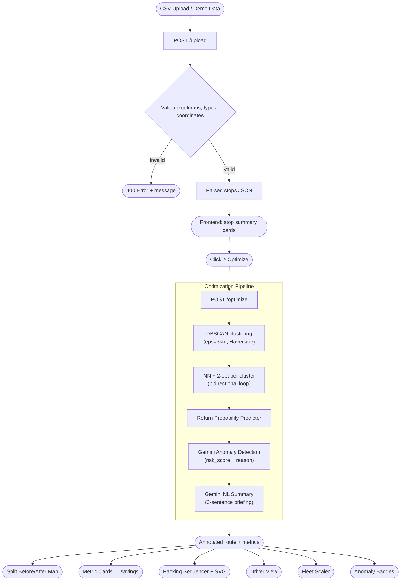

# 🟢 Greenmile — Bidirectional Last-Mile Logistics Optimizer

> _"The greenest mile is the one you don't drive twice."_

**Greenmile** is an AI-powered logistics optimizer that merges outbound deliveries and inbound returns into a single smart loop — eliminating the empty-van problem that wastes 40% of last-mile fuel in India.

Built for **FAR AWAY 2026 Hackathon · Theme: Logistics & Transit**

🌐 **Live Demo → [greenmile-seven.vercel.app](https://greenmile-seven.vercel.app/)**
📊 **Presentation → [GreenMile PPT](https://docs.google.com/presentation/d/16DIOttygRqafvQ5uakdc6B03lOPCy-Ll/edit?usp=sharing&ouid=111781734386739260632&rtpof=true&sd=true)**

---

## 📌 The Problem

Every day, Indian delivery fleets run **two separate trips** for the same set of customers:

```
Trip 1 (Delivery):   Warehouse ──📦──→ Customers ──🚫──→ Warehouse   (van returns EMPTY)
Trip 2 (Returns):    Warehouse ──🚫──→ Customers ──📦──→ Warehouse   (van leaves EMPTY)
```

That's **2 trips, 2 fuel tanks, 2 driver shifts** — for work that one loop could cover. No existing tool on the market combines deliveries and returns into a single optimized route.

## 💡 The Solution

Greenmile merges both trips into **one bidirectional loop**:

```
Warehouse ──📦 deliver──→ Customers ──↩️ collect returns──→ Warehouse
                       ONE TRIP. ONE VAN. ONE DRIVER.
```

The van delivers packages on the way out and picks up returns on the way back. No empty legs. No wasted fuel.

### Impact Per Van Per Day

| Metric        | Before (2 Trips) | After (1 Loop) |       Saved       |
| ------------- | :--------------: | :------------: | :---------------: |
| Distance      |      87 km       |     52 km      | **▼ 35 km (40%)** |
| Fuel Cost     |       ₹653       |      ₹390      |  **▼ ₹263/day**   |
| CO₂ Emissions |     19.4 kg      |    11.6 kg     |   **▼ 7.8 kg**    |
| Driver Hours  |     8.2 hrs      |    5.1 hrs     |   **▼ 3.1 hrs**   |

> For a **50-van fleet**: ₹33 lakh saved/year · 97 tonnes CO₂ avoided · ≈ 4,600 trees equivalent

---

## ✨ Key Features

### 🧠 AI-Powered Intelligence (Gemini 2.0 Flash)

- **Fraud & Anomaly Detection** — Analyses return stop metadata (frequency, disputes, confirmation delays) and flags suspicious patterns with risk scores (0–1), reasons, and actions (HOLD / VERIFY / PROCEED)
- **Natural Language Briefing** — Generates a 3-sentence plain-English route summary that non-technical fleet managers can read in 10 seconds
- **Return Probability Predictor** — Scores each delivery for return likelihood and pre-allocates van space for predicted returns

> **Graceful fallback**: if no Gemini API key is provided, the system automatically falls back to heuristic anomaly detection and a static route summary — no crash, no empty UI.

### 🗺️ Route Optimization Engine

- **DBSCAN Geographic Clustering** — Groups nearby stops into zones using haversine distance (eps = 3 km), so each van handles a tight geographic area
- **Bidirectional Loop Optimizer** — Nearest-Neighbour seed + 2-opt improvement builds one loop: deliver outbound → collect returns inbound → return to warehouse
- **Before/After Split Map** — Side-by-side Leaflet maps showing the old 2-trip routes (red + blue) vs the optimized green loop with progressive drawing animation

### 📦 Operations Tools

- **Packing Sequencer** — SVG bird's-eye van diagram showing exactly how to load: returns at the rear (collected last), deliveries at the front (dropped first). Warehouse workers follow the numbered checklist
- **Driver Mobile View** — One-stop-at-a-time interface with navigation, progress tracking, and inline anomaly warnings
- **Fleet Scaler** — Slider projecting annual savings from 1 to 50 vans with live ₹/CO₂/hours calculations

---

## 🏗️ Architecture

```
greenmile/
├── backend/
│   ├── app/
│   │   ├── main.py                  # FastAPI — /upload, /optimize endpoints
│   │   ├── models.py                # Pydantic schemas: Stop, OptimizationRequest
│   │   └── optimizer/
│   │       ├── dbscan.py            # DBSCAN geographic clustering (haversine)
│   │       ├── haversine.py         # Great-circle distance matrix
│   │       ├── route.py             # NN + 2-opt bidirectional loop builder
│   │       └── return_predictor.py  # Return probability scoring heuristic
│   ├── ai/
│   │   ├── anomaly.py               # Gemini fraud detector (google-genai SDK)
│   │   └── summary.py               # Gemini NL route summary generator
│   └── requirements.txt
├── frontend/
│   ├── src/
│   │   ├── app/                     # Next.js App Router pages + route states
│   │   ├── components/              # Trip, performance, system, packing, driver UI
│   │   ├── lib/api.ts               # Typed REST + SSE backend client
│   │   ├── lib/                     # Shared frontend utilities
│   │   └── types/                   # Greenmile domain models
│   ├── next.config.ts
│   └── package.json
├── data/
│   └── demo_stops.csv               # 18 seeded stops — Delhi-NCR Zone B
├── frontend/vercel.json             # Vercel frontend deployment config
└── render.yaml                      # Render backend deployment config
```

### System Flow


```mermaid
flowchart TD
    A([CSV Upload / Demo Data]) --> B[POST /upload]
    B --> C{Validate columns, types, coordinates}
    C -->|Invalid| D([400 Error + message])
    C -->|Valid| E[Parsed stops JSON]
    E --> F([Frontend: stop summary cards])
    F --> G([Click ⚡ Optimize])
    G --> H[POST /optimize]

    subgraph Pipeline ["Optimization Pipeline"]
        H --> I["DBSCAN clustering<br/>(eps=3km, Haversine)"]
        I --> J["NN + 2-opt per cluster<br/>(bidirectional loop)"]
        J --> K["Return Probability Predictor"]
        K --> L["Gemini Anomaly Detection<br/>(risk_score + reason)"]
        L --> M["Gemini NL Summary<br/>(3-sentence briefing)"]
    end

    M --> N([Annotated route + metrics])
    N --> O([Split Before/After Map])
    N --> P([Metric Cards — savings])
    N --> Q([Packing Sequencer + SVG])
    N --> R([Driver View])
    N --> S([Fleet Scaler])
    N --> T([Anomaly Badges])
```

---

## 🚀 Quick Start

### Prerequisites

- Python 3.10+ and Node.js 20.9+
- Docker Desktop for the full stack
- An Azure OpenAI resource is optional; without it, route optimization still works and intelligence is reported as unavailable

### 1. Backend

```bash
cd backend
pip install -r requirements.txt
```

Create a `.env` file inside `backend/`:

```
GEMINI_API_KEY=your_gemini_api_key_here
```

Start the server:

```bash
python -m uvicorn app.main:app --port 8000
```

API docs → http://localhost:8000/docs

### 2. Frontend

```bash
cd frontend
npm install
npm run dev
```

The frontend reads persisted scenarios and computed results from the FastAPI backend. The recommended full-stack workflow is `docker compose up --build`; see `environment.example` for optional Azure OpenAI configuration.

Greenmile → http://localhost:3000

### 3. Try the Demo

1. Open http://localhost:3000
2. Click **Try Delhi demo**
3. Click **Optimize this trip** and watch each engine stage complete
4. Explore the route transformation, impact, intelligence, packing, and driver views
5. Open **Performance**, **System**, and **How it works** from the navigation

---

## ☁️ Deployment

🌐 **Frontend** → [greenmile-seven.vercel.app](https://greenmile-seven.vercel.app/) (Vercel)

### Frontend → Vercel

`frontend/vercel.json` identifies the application as a native Next.js project.

1. Push this repo to GitHub
2. Go to [vercel.com](https://vercel.com) → **Add New Project** → import your repo
3. Set **Root Directory** to `frontend`
4. Set `NEXT_PUBLIC_API_URL` to the deployed FastAPI origin
5. Deploy — Vercel auto-detects Next.js

### Backend → Render

`render.yaml` at the project root configures a free-tier Python web service:

1. Go to [render.com](https://render.com) → **New → Blueprint** → connect your repo
2. Render auto-reads `render.yaml` and provisions the service
3. In the Render dashboard, go to **Environment** and add `GEMINI_API_KEY`

---

## 🔌 API Reference

| Method | Endpoint    | Description                                                               |
| ------ | ----------- | ------------------------------------------------------------------------- |
| `GET`  | `/`         | Health check — returns API status and Gemini config                       |
| `GET`  | `/docs`     | Interactive Swagger UI                                                    |
| `POST` | `/upload`   | Upload CSV file → returns parsed + validated stops JSON                   |
| `POST` | `/optimize` | Accepts `{ stops: Stop[] }` → returns optimized route with AI annotations |

### Stop Schema

```json
{
  "stop_id": "D7",
  "type": "DELIVERY",
  "lat": 28.5479,
  "lng": 77.2118,
  "address": "Malviya Nagar",
  "weight_kg": 4.1,
  "volume_l": 18,
  "time_window_start": "12:00",
  "time_window_end": "15:00",
  "cluster_id": "Zone_B",
  "return_count_30d": 3,
  "avg_delivery_confirm_minutes": 15,
  "dispute_history_count": 1
}
```

`type` must be `"DELIVERY"` or `"RETURN"`.

### Optimization Response

The `/optimize` endpoint returns:

- `route` — Ordered list of stops annotated with `risk_score`, `flag`, `reason`, `suggested_action`, `return_probability`, `pre_stage_return`
- `nl_summary` — Gemini-generated 3-sentence route briefing
- `metrics` — Before/after distance, fuel cost, CO₂, driver hours
- `flagged_count` — Number of stops with anomaly flags
- `pre_staged_returns` — Number of delivery stops pre-allocated a return bay

### CSV Format

Required columns (see `data/demo_stops.csv` for a working example):

```
stop_id, type, lat, lng, address, weight_kg, volume_l,
time_window_start, time_window_end, cluster_id,
return_count_30d, avg_delivery_confirm_minutes, dispute_history_count
```

---

## 🛠️ Tech Stack

| Layer            | Technology                                          |
| ---------------- | --------------------------------------------------- |
| **Backend**      | Python 3.12 · FastAPI · Uvicorn                     |
| **Optimization** | scikit-learn (DBSCAN) · scipy · custom NN + 2-opt   |
| **AI**           | Azure OpenAI structured outputs (post-route)        |
| **Frontend**     | Next.js 16 · React 19 · TypeScript · Tailwind CSS 4 |
| **Maps**         | Responsive SVG route visualization                  |
| **Data**         | pandas · CSV validation · Pydantic v2 models        |

---

_Greenmile v2.0 · Built for India's last mile 🇮🇳_
